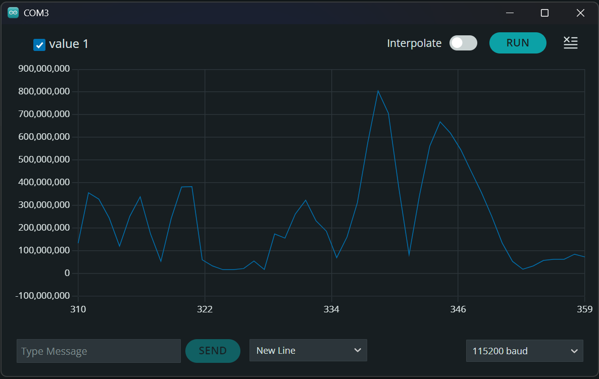

# Arduino prototip za testiranje mikrofona

https://www.youtube.com/watch?v=UkJIMCtsypo

Koristio sam Arduino zbog mogućnosti Serial Plottera za lakše testiranje 
mikrofona. "Spike" je detektirani zvuk.

Dodatno: https://www.youtube.com/watch?v=m-MPBjScNRk
